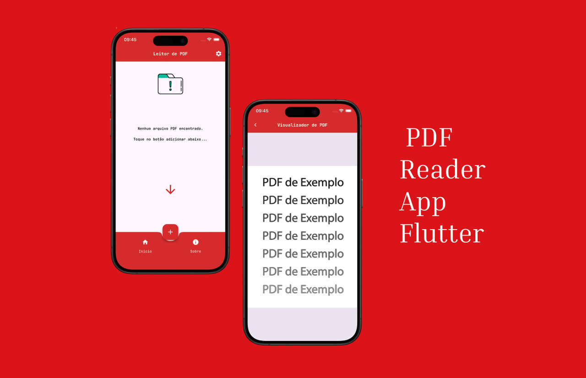

<h1 align="center" id="header">
  PDF Reader App - Flutter Multi-Platform Application
</h1>

<p align="center">
  
  
  
</p>

<p align="center">
  A multi-platform PDF reader application built with Flutter. Features responsive UI, multi-language support, and seamless PDF viewing experience.
</p>

---

<h2 id="stack">
  Tech Stack
</h2>

<p>


</p>

### Core Technologies

- **Dart** - Programming language
- **Flutter** - Cross-platform UI framework
- **Material Design 3** - Modern design system
- **Provider** - State management solution

### Features & Integrations

- **Multi-Platform Support** - Android, iOS
- **Google Fonts** - Beautiful typography
- **i18n** - Multi-language support (EN / PT-BR / ES)
- **Flutter PDF Viewer** - PDF rendering and display
- **Flutter Local Notifications** - Push notifications
- **URL Launcher** - External link handling
- **Timezone Initialization** - Time zone support

---

<h2 id="prerequisites">
  Prerequisites
</h2>

Before starting, ensure you have the following installed:

- [Flutter SDK](https://flutter.dev/docs/get-started/install) (latest stable version)
- [Dart SDK](https://dart.dev/get-dart) (included with Flutter)
- [Git](https://git-scm.com/)
- [Xcode](https://developer.apple.com/xcode/) (for iOS development on macOS)
- [Android Studio](https://developer.android.com/studio) (for Android development)

> Optional: [Zed Editor](https://zed.dev/) or [VS Code](https://code.visualstudio.com/) with Flutter plugins for IDE support.

---

<h2 id="installation">
  Installation & Setup
</h2>

### 1. Clone the Repository

```bash
git clone https://github.com/Victor-Zarzar/pdf-reader
cd pdf-reader
```

### 2. Open in your editor (Zed Editor)

```bash
zed .
```

### 3. Install Dependencies

```bash
flutter pub get
```

---

<h2 id="usage">
  Usage
</h2>

### Local Development

#### Mobile (iOS Simulator)

Run on iPhone simulator:

```bash
flutter run -d "iPhone 17 Pro"
```

#### Mobile (Android Emulator)

Run on Android emulator:

```bash
flutter run -d android
```

---

<h2 id="development">
  Development
</h2>

### Code Analysis

Check for code issues:

```bash
flutter analyze
```

### Testing

Run all tests:

```bash
flutter test
```

### Format Code

Format all files:

```bash
dart format .
```

---

<h2 id="project-structure">
  Project Structure
</h2>

```
pdf-reader/
├── lib/                     # Application source code
│   ├── controller/          # Business logic controllers
│   │   └── entity/          # Entity controllers
│   ├── features/            # App features
│   ├── services/            # Services layer
│   └── view/                # UI layer
│       └── widget/          # Reusable widgets
├── assets/                  # Static assets
│   └── imgs/                # Images and mockups
├── android/                 # Android platform code
├── ios/                     # iOS platform code
├── test/                    # Unit and widget tests
├── pubspec.yaml             # Flutter dependencies
└── README.md                # Project documentation
```

---

<h2 id="screenshots">
  Screenshots
</h2>

### Project Mockup

<p align="center">
  
</p>

---

<h2 id="deployment">
   Deployment
</h2>

### Android (Google Play Store)

Build production APK:

```bash
flutter build apk --release
```

The generated file will be at: `build/app/outputs/flutter-apk/app-release.apk`

Build production AppBundle:

```bash
flutter build appbundle --release
```

The generated file will be at: `build/app/outputs/bundle/release/app-release.aab`

### iOS (App Store)

Build production iOS app:

```bash
flutter build ios --release
```

The generated file will be at: `build/ios/iphoneos/`

---

<h2 id="contributing">
  Contributing
</h2>

Contributions are welcome! Please feel free to submit a Pull Request.

1. Fork the project
2. Create your feature branch (`git checkout -b feature/AmazingFeature`)
3. Commit your changes (`git commit -m 'Add some AmazingFeature'`)
4. Push to the branch (`git push origin feature/AmazingFeature`)
5. Open a Pull Request

---

<h2 id="license">
  License
</h2>

This project is licensed under the MIT License - see the [LICENSE](LICENSE) file for details.

---

<h2 id="contact">
  Contact
</h2>

Victor Zarzar - [@Victor-Zarzar](https://github.com/Victor-Zarzar)

Project Link: [https://github.com/Victor-Zarzar/pdf-reader](https://github.com/Victor-Zarzar/pdf-reader)

---

<p align="center">
  Made with ❤️ by Victor Zarzar
</p>
