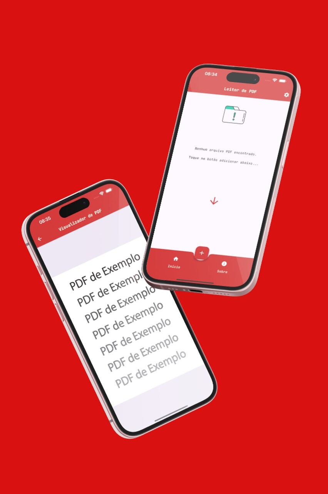
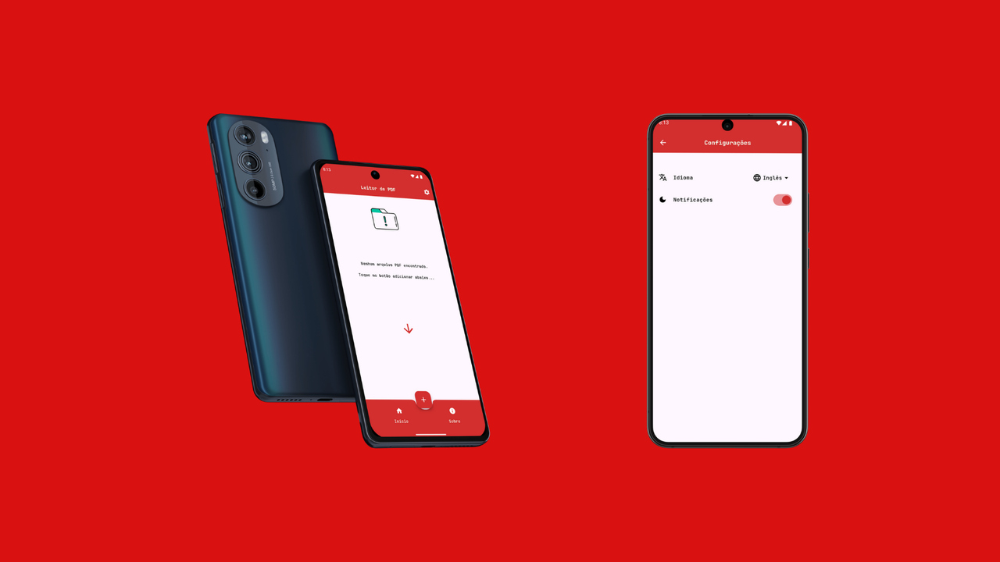

<h1 align="center" id="header">
 PDF Reader App Flutter
</h1>

🤖 Stack:

- Dart
- Flutter
- Material 3 (UI)
- Google Fonts
- Url Launcher
- Locale Language EN / PT-BR / ES
- Flutter PDF Viewer
- Flutter local notifications
- Timezone
- Provider (State Managment)

 

⚙️ How to install:

Project Clone

     git clone https://github.com/Victor-Zarzar/pdf-reader

Enter in directory:

     cd age-pet

Open in your favorite editor(e.g. VSCode):

    code .

For install dependencies:

    flutter pub get

Run the app:

    flutter run

### Version iOS:

  

   

### Version Android:

  

